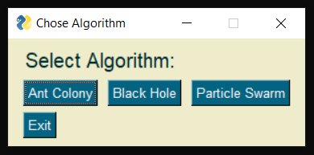
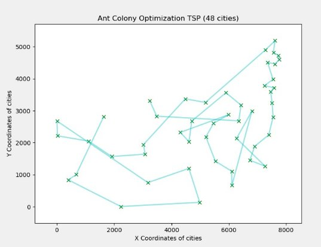
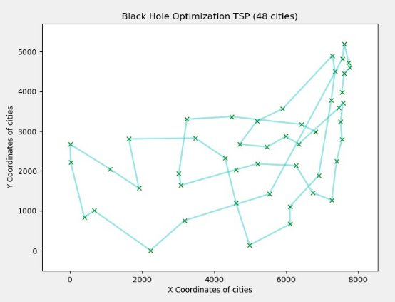

**Introduction**\
Travelling Salesman Problem is  an NP-hard problem which means that currently there is no algorithm that solves this problem in a polynomial time.
We need to find the shortest possible tour that visits each city once and returns to the starting point given the list of cities and the distances between each pair of cities to find the solution of this problem.
In this project, we implement a meta-heuristic approach to trying to solve this problem using 3 different techniques as follows:
Ant Colony Optimization
Black Hole Optimization
Particle Swarm Optimization

**Ant Colony Optimization(ACO)**\
Ant Colony Optimization is a Genetic Algorithm(GA), which uses probabilistic techniques to obtain approximate optimal solution of the given graph. 
All possible solutions are represented by the parameter space which is traversed by artificial ants in order to obtain optimal solution. 
As real ants leave pheromones along their path to guide other ants towards resources; artificial ants also mimic that behaviour by recording their position (giving probabilistic score) to guide other ants for better solutions.

**Black Hole Optimization(BHO)**\
The Black Hole Algorithm is a nature-inspired algorithm that mimics the blackhole phenomenon that occurs in the nature.
In Black Hole Optimisation, initially a population of possible solutions is generated randomly.
Then, fitness value of each possible solution is evaluated and the best candidate among the population is chosen to be the black hole and the rest form the normal stars.
After black hole starts absorbing the stars around it, and all the stars starts move towards the black hole.

**Particle Swarm Optimization(PSO)**\
To calculate the Travelling Salesman Problem using Particle Swarm Optimisation, we use the concept of Swap Operator and Swap Sequence. The Particle Swarm Optimisation is mimics the social behaviour that is commonly depicted in organisms. These organisms travel through possible solutions and can store the best solution so far. All the organisms share solutions with each other to calculate the global best solution.

**How to use this repo**\
To run this project initially run the IntegratedIP.py file using the following command: python IntegratedIP.py

This will open a window as follows:

You can choose any of the three algorithms and a corresponding window will open according to the algorithm selected. Following are the window images.

You can now choose the respective parameters according to the algorithm. Please let the iterations run completely for proper output and solution.

Following is how the outputs will look:

THANK YOU
