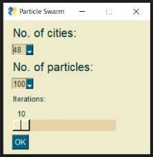
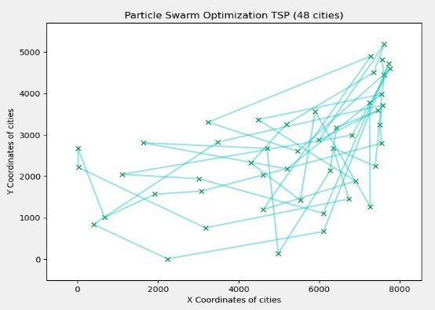

To run this project initially run the IntegratedIP.py file using the following command: python IntegratedIP.py

This will open a window as follows:

You can choose any of the three algorithms and a corresponding window will open according to the algorithm selected. Following are the window images.

You can now choose the respective parameters according to the algorithm. Please let the iterations run completely for proper output and solution.

Following is how the outputs will look:

THANK YOU
